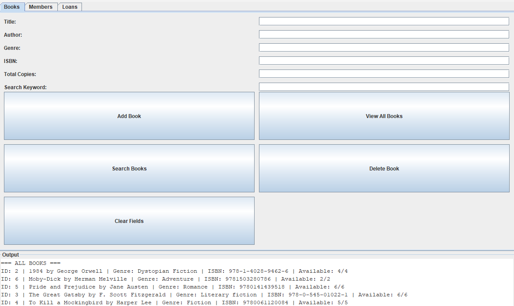

Built a Java-based library management system using Java Swing for the UI, JDBC for database connectivity, and MySQL for persistent storage. The application follows a layered design, where user interactions in the GUI are processed through a service layer and executed as SQL queries via DAO classes. Supports full CRUD operations for books and members, as well as loan tracking with availability updates.

 
 
 
